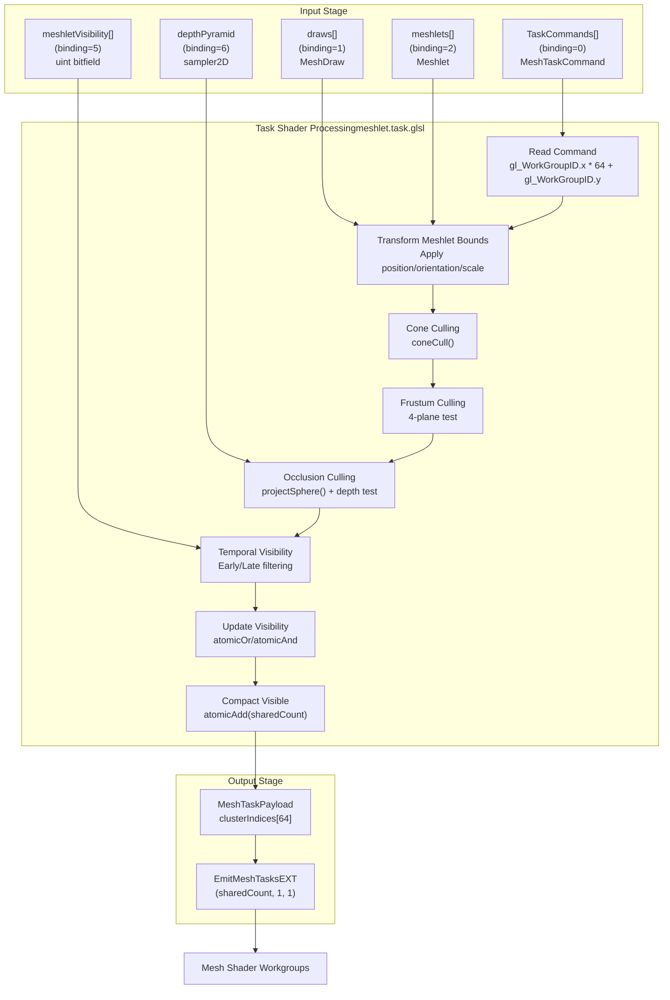
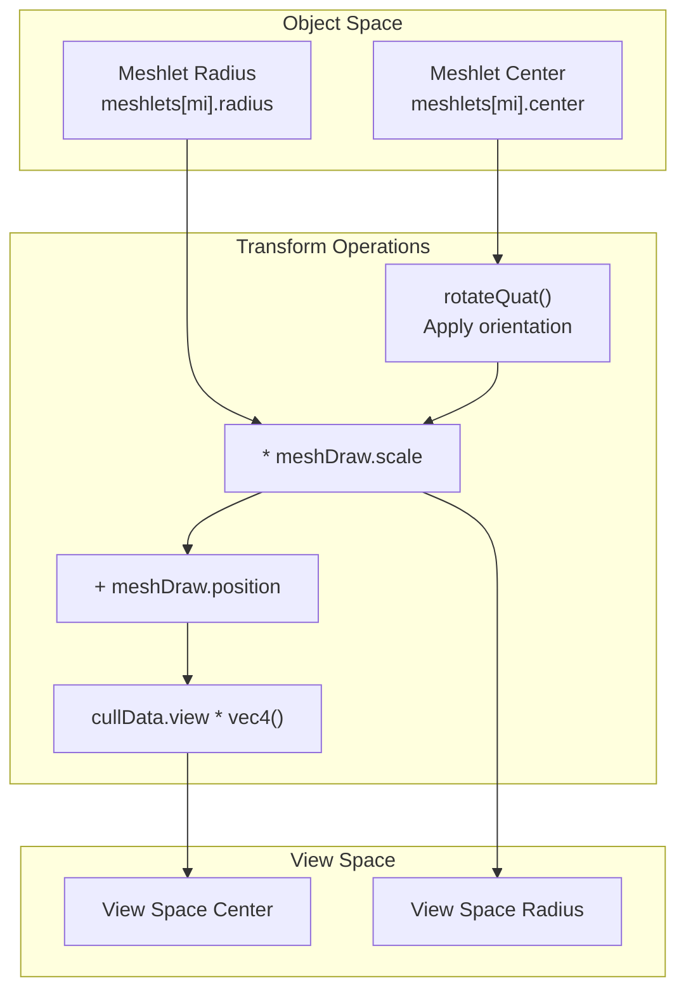
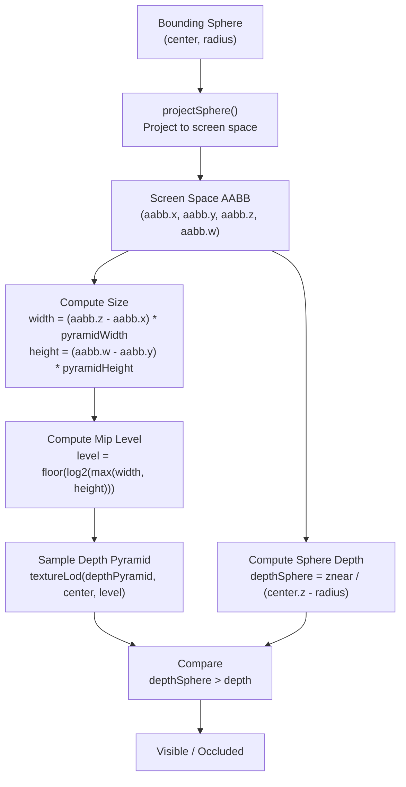
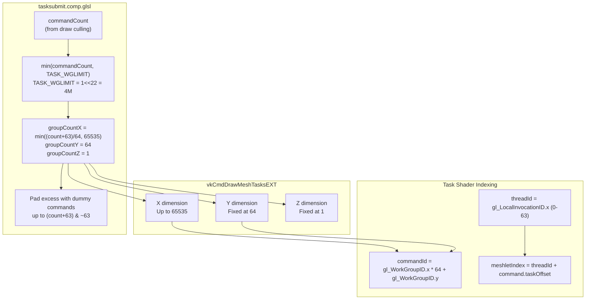

# Task Shader Stage

> **Relevant source files**
> * [src/config.h](https://github.com/zeux/niagara/blob/6f3fb529/src/config.h)
> * [src/shaders/clustersubmit.comp.glsl](https://github.com/zeux/niagara/blob/6f3fb529/src/shaders/clustersubmit.comp.glsl)
> * [src/shaders/meshlet.task.glsl](https://github.com/zeux/niagara/blob/6f3fb529/src/shaders/meshlet.task.glsl)
> * [src/shaders/tasksubmit.comp.glsl](https://github.com/zeux/niagara/blob/6f3fb529/src/shaders/tasksubmit.comp.glsl)

## Purpose and Scope

The task shader stage performs fine-grained, per-meshlet culling as part of the GPU-driven rendering pipeline. This stage receives task commands from the draw culling stage (see [Draw Culling Pipeline](/zeux/niagara/7.1-draw-culling-pipeline)) and determines which individual meshlets should be rendered. For each visible meshlet, the task shader emits a mesh shader workgroup (see [Mesh Shader Stage](/zeux/niagara/7.3-mesh-shader-stage)) via the `EmitMeshTasksEXT` function. The task shader implements multiple culling techniques including backface cone culling, frustum culling, and hierarchical occlusion culling against a depth pyramid. It also manages temporal visibility tracking to support the two-phase rendering strategy (see [Two-Phase Rendering Strategy](/zeux/niagara/7.4-two-phase-rendering-strategy)).

---

## Task Shader Architecture

The task shader is implemented in `meshlet.task.glsl` and operates as an amplification shader in the Vulkan mesh shading pipeline. Each task shader workgroup processes up to 64 meshlets in parallel (configurable via `TASK_WGSIZE`), performing culling tests and emitting only the visible meshlets for further processing.

**Task Shader Pipeline Flow**



**Sources:** [src/shaders/meshlet.task.glsl L1-L150](https://github.com/zeux/niagara/blob/6f3fb529/src/shaders/meshlet.task.glsl#L1-L150)

---

## Input Data Structures

The task shader receives multiple input buffers that describe the rendering work and scene geometry:

| Binding | Type | Data Structure | Purpose |
| --- | --- | --- | --- |
| 0 | Storage Buffer (readonly) | `MeshTaskCommand[]` | Commands generated by draw culling stage |
| 1 | Storage Buffer (readonly) | `MeshDraw[]` | Per-draw instance data (transform, mesh/material indices) |
| 2 | Storage Buffer (readonly) | `Meshlet[]` | Meshlet geometry descriptors with bounds and cone data |
| 5 | Storage Buffer (read/write) | `uint[]` | Meshlet visibility bitfield for temporal coherency |
| 6 | Sampler2D | Depth Pyramid | Hierarchical depth buffer for occlusion culling |

**Command Indexing**

The task shader converts 2D dispatch indices to a linear command index using a fixed multiplier:

```
commandId = gl_WorkGroupID.x * 64 + gl_WorkGroupID.y
```

This indexing scheme is established by `tasksubmit.comp.glsl` which configures the dispatch as `X*64*1` to support up to ~4M task commands while respecting the 65535 limit on X dimension.

**Sources:** [src/shaders/meshlet.task.glsl L23-L44](https://github.com/zeux/niagara/blob/6f3fb529/src/shaders/meshlet.task.glsl#L23-L44)

 [src/shaders/tasksubmit.comp.glsl L32-L39](https://github.com/zeux/niagara/blob/6f3fb529/src/shaders/tasksubmit.comp.glsl#L32-L39)

---

## Meshlet Transform and Bounds Computation

Each thread in the task shader workgroup processes one meshlet. The first operation transforms the meshlet's bounding sphere from object space to view space:



The cone axis (used for backface culling) is similarly transformed:

1. Decode from packed int8 format: `int(cone_axis[i]) / 127.0`
2. Apply quaternion rotation: `rotateQuat(cone_axis, orientation)`
3. Apply view matrix rotation: `mat3(cullData.view) * cone_axis`

**Sources:** [src/shaders/meshlet.task.glsl L72-L80](https://github.com/zeux/niagara/blob/6f3fb529/src/shaders/meshlet.task.glsl#L72-L80)

---

## Culling Operations

The task shader implements four primary culling techniques that progressively filter meshlets. Each technique is conditional on configuration flags and rendering pass.

### Cone Culling (Backface Culling)

Cone culling tests whether a meshlet is backfacing using the normal cone data precomputed during meshlet generation (see [Meshlet Generation and Optimization](/zeux/niagara/10.1-meshlet-generation-and-optimization)). Each meshlet stores a cone axis and cutoff angle that bounds all triangle normals within the meshlet.

```
visible = visible && (cullData.clusterBackfaceEnabled == 0 || 
                      !coneCull(center, radius, cone_axis, cone_cutoff, vec3(0,0,0)))
```

The `coneCull()` function from `math.h` tests if the cone is facing away from the camera origin in view space.

**Sources:** [src/shaders/meshlet.task.glsl L102](https://github.com/zeux/niagara/blob/6f3fb529/src/shaders/meshlet.task.glsl#L102-L102)

### Frustum Culling

Frustum culling tests the meshlet's bounding sphere against the view frustum planes. The implementation uses frustum symmetry to test two planes simultaneously, reducing the number of comparisons:

```
// Left/Right and Top/Bottom planes tested together
visible = visible && center.z * cullData.frustum[1] - abs(center.x) * cullData.frustum[0] > -radius;
visible = visible && center.z * cullData.frustum[3] - abs(center.y) * cullData.frustum[2] > -radius;

// Near/Far planes tested separately
visible = visible && center.z + radius > cullData.znear && center.z - radius < cullData.zfar;
```

The frustum coefficients are precomputed from the projection matrix and stored in `cullData.frustum[]`.

**Sources:** [src/shaders/meshlet.task.glsl L104-L108](https://github.com/zeux/niagara/blob/6f3fb529/src/shaders/meshlet.task.glsl#L104-L108)

### Occlusion Culling

In the late pass, the task shader performs hierarchical occlusion culling by testing the meshlet's bounding sphere against the depth pyramid generated from the early pass (see [Two-Phase Rendering Strategy](/zeux/niagara/7.4-two-phase-rendering-strategy)).

**Occlusion Test Pipeline**



The depth pyramid sampler is configured with min reduction, so sampling a 2x2 texel quad returns the minimum (nearest) depth value. This conservative approach reduces false occlusion.

**Sources:** [src/shaders/meshlet.task.glsl L110-L126](https://github.com/zeux/niagara/blob/6f3fb529/src/shaders/meshlet.task.glsl#L110-L126)

---

## Early vs Late Pass Behavior

The task shader has significantly different behavior in the early and late passes, controlled by the `LATE` specialization constant. This implements the temporal visibility tracking system.

**Early Pass (`LATE = false`)**

The early pass renders only meshlets that were visible in the previous frame:

```
if (!LATE && meshletVisibilityBit == 0)
    visible = false;
```

This ensures the depth pyramid is built from previously-visible geometry, providing a good basis for occlusion culling in the late pass.

**Late Pass (`LATE = true`)**

The late pass has three key behaviors:

1. **Skip Previously Visible Meshlets of Previously Visible Objects:** ``` if (LATE && lateDrawVisibility == 1 && meshletVisibilityBit != 0)     skip = true; ``` This avoids re-rendering meshlets already rendered in the early pass.
2. **Perform Occlusion Culling:** The late pass performs hierarchical occlusion testing against the depth pyramid.
3. **Update Visibility Buffer:** After culling, the late pass atomically updates the visibility bitfield: ``` if (visible)     atomicOr(meshletVisibility[mvi >> 5], 1u << (mvi & 31)); else     atomicAnd(meshletVisibility[mvi >> 5], ~(1u << (mvi & 31))); ```

**Temporal Visibility State Machine**

```css
#mermaid-f2iqejme6hh{font-family:ui-sans-serif,-apple-system,system-ui,Segoe UI,Helvetica;font-size:16px;fill:#ccc;}@keyframes edge-animation-frame{from{stroke-dashoffset:0;}}@keyframes dash{to{stroke-dashoffset:0;}}#mermaid-f2iqejme6hh .edge-animation-slow{stroke-dasharray:9,5!important;stroke-dashoffset:900;animation:dash 50s linear infinite;stroke-linecap:round;}#mermaid-f2iqejme6hh .edge-animation-fast{stroke-dasharray:9,5!important;stroke-dashoffset:900;animation:dash 20s linear infinite;stroke-linecap:round;}#mermaid-f2iqejme6hh .error-icon{fill:#333;}#mermaid-f2iqejme6hh .error-text{fill:#cccccc;stroke:#cccccc;}#mermaid-f2iqejme6hh .edge-thickness-normal{stroke-width:1px;}#mermaid-f2iqejme6hh .edge-thickness-thick{stroke-width:3.5px;}#mermaid-f2iqejme6hh .edge-pattern-solid{stroke-dasharray:0;}#mermaid-f2iqejme6hh .edge-thickness-invisible{stroke-width:0;fill:none;}#mermaid-f2iqejme6hh .edge-pattern-dashed{stroke-dasharray:3;}#mermaid-f2iqejme6hh .edge-pattern-dotted{stroke-dasharray:2;}#mermaid-f2iqejme6hh .marker{fill:#666;stroke:#666;}#mermaid-f2iqejme6hh .marker.cross{stroke:#666;}#mermaid-f2iqejme6hh svg{font-family:ui-sans-serif,-apple-system,system-ui,Segoe UI,Helvetica;font-size:16px;}#mermaid-f2iqejme6hh p{margin:0;}#mermaid-f2iqejme6hh defs #statediagram-barbEnd{fill:#666;stroke:#666;}#mermaid-f2iqejme6hh g.stateGroup text{fill:#222;stroke:none;font-size:10px;}#mermaid-f2iqejme6hh g.stateGroup text{fill:#ccc;stroke:none;font-size:10px;}#mermaid-f2iqejme6hh g.stateGroup .state-title{font-weight:bolder;fill:#fff;}#mermaid-f2iqejme6hh g.stateGroup rect{fill:#111;stroke:#222;}#mermaid-f2iqejme6hh g.stateGroup line{stroke:#666;stroke-width:1;}#mermaid-f2iqejme6hh .transition{stroke:#666;stroke-width:1;fill:none;}#mermaid-f2iqejme6hh .stateGroup .composit{fill:#f4f4f4;border-bottom:1px;}#mermaid-f2iqejme6hh .stateGroup .alt-composit{fill:#e0e0e0;border-bottom:1px;}#mermaid-f2iqejme6hh .state-note{stroke:#333;fill:#222;}#mermaid-f2iqejme6hh .state-note text{fill:#ccc;stroke:none;font-size:10px;}#mermaid-f2iqejme6hh .stateLabel .box{stroke:none;stroke-width:0;fill:#111;opacity:0.5;}#mermaid-f2iqejme6hh .edgeLabel .label rect{fill:#111;opacity:0.5;}#mermaid-f2iqejme6hh .edgeLabel{background-color:#161616;text-align:center;}#mermaid-f2iqejme6hh .edgeLabel p{background-color:#161616;}#mermaid-f2iqejme6hh .edgeLabel rect{opacity:0.5;background-color:#161616;fill:#161616;}#mermaid-f2iqejme6hh .edgeLabel .label text{fill:#ccc;}#mermaid-f2iqejme6hh .label div .edgeLabel{color:#ccc;}#mermaid-f2iqejme6hh .stateLabel text{fill:#fff;font-size:10px;font-weight:bold;}#mermaid-f2iqejme6hh .node circle.state-start{fill:#666;stroke:#666;}#mermaid-f2iqejme6hh .node .fork-join{fill:#666;stroke:#666;}#mermaid-f2iqejme6hh .node circle.state-end{fill:#222;stroke:#f4f4f4;stroke-width:1.5;}#mermaid-f2iqejme6hh .end-state-inner{fill:#f4f4f4;stroke-width:1.5;}#mermaid-f2iqejme6hh .node rect{fill:#111;stroke:#222;stroke-width:1px;}#mermaid-f2iqejme6hh .node polygon{fill:#111;stroke:#222;stroke-width:1px;}#mermaid-f2iqejme6hh #statediagram-barbEnd{fill:#666;}#mermaid-f2iqejme6hh .statediagram-cluster rect{fill:#111;stroke:#222;stroke-width:1px;}#mermaid-f2iqejme6hh .cluster-label,#mermaid-f2iqejme6hh .nodeLabel{color:#fff;}#mermaid-f2iqejme6hh .statediagram-cluster rect.outer{rx:5px;ry:5px;}#mermaid-f2iqejme6hh .statediagram-state .divider{stroke:#222;}#mermaid-f2iqejme6hh .statediagram-state .title-state{rx:5px;ry:5px;}#mermaid-f2iqejme6hh .statediagram-cluster.statediagram-cluster .inner{fill:#f4f4f4;}#mermaid-f2iqejme6hh .statediagram-cluster.statediagram-cluster-alt .inner{fill:#161616;}#mermaid-f2iqejme6hh .statediagram-cluster .inner{rx:0;ry:0;}#mermaid-f2iqejme6hh .statediagram-state rect.basic{rx:5px;ry:5px;}#mermaid-f2iqejme6hh .statediagram-state rect.divider{stroke-dasharray:10,10;fill:#161616;}#mermaid-f2iqejme6hh .note-edge{stroke-dasharray:5;}#mermaid-f2iqejme6hh .statediagram-note rect{fill:#222;stroke:#333;stroke-width:1px;rx:0;ry:0;}#mermaid-f2iqejme6hh .statediagram-note rect{fill:#222;stroke:#333;stroke-width:1px;rx:0;ry:0;}#mermaid-f2iqejme6hh .statediagram-note text{fill:#ccc;}#mermaid-f2iqejme6hh .statediagram-note .nodeLabel{color:#ccc;}#mermaid-f2iqejme6hh .statediagram .edgeLabel{color:red;}#mermaid-f2iqejme6hh #dependencyStart,#mermaid-f2iqejme6hh #dependencyEnd{fill:#666;stroke:#666;stroke-width:1;}#mermaid-f2iqejme6hh .statediagramTitleText{text-anchor:middle;font-size:18px;fill:#ccc;}#mermaid-f2iqejme6hh :root{--mermaid-font-family:"trebuchet ms",verdana,arial,sans-serif;}RenderedNot renderedskip = trueOcclusion testvisible = truevisible = falseNext frameNext frameVisibleLastFrameNotVisibleLastFrameEarlyPassSkippedLatePassVisibleThisFrameNotVisibleThisFrameEarly pass renderspreviously visiblemeshlets onlyLate pass skipsalready-renderedmeshlets and testsocclusion for newones
```

**Sources:** [src/shaders/meshlet.task.glsl L86-L134](https://github.com/zeux/niagara/blob/6f3fb529/src/shaders/meshlet.task.glsl#L86-L134)

---

## Visibility Compaction and Payload Generation

After culling, visible meshlets are compacted into the task payload using shared memory atomics:

```
if (visible && !skip)
{
    uint index = atomicAdd(sharedCount, 1);
    payload.clusterIndices[index] = commandId | (mgi << 24);
}
```

The `clusterIndices` array packs both the command ID (lower 24 bits) and the local meshlet group index (upper 8 bits) into a single 32-bit value. This packed format allows the mesh shader to efficiently retrieve both the original command and which meshlet to process.

**Payload Structure**

| Field | Type | Size | Purpose |
| --- | --- | --- | --- |
| `clusterIndices` | `uint[]` | 64 elements | Packed (commandId, meshletGroupIndex) for visible meshlets |

The workgroup synchronizes twice during execution:

1. Before culling to initialize `sharedCount = 0`
2. After compaction to read final `sharedCount` for emission

**Sources:** [src/shaders/meshlet.task.glsl L45-L144](https://github.com/zeux/niagara/blob/6f3fb529/src/shaders/meshlet.task.glsl#L45-L144)

---

## Mesh Shader Emission

The final operation emits mesh shader workgroups for the visible meshlets:

```
EmitMeshTasksEXT(sharedCount, 1, 1);
```

When culling is disabled (`CULL = 0`), the task shader emits all meshlets without filtering:

```
payload.clusterIndices[gl_LocalInvocationID.x] = commandId | (mgi << 24);
EmitMeshTasksEXT(taskCount, 1, 1);
```

Each emitted mesh shader workgroup receives the shared `MeshTaskPayload` containing the cluster indices. The mesh shader uses these indices to fetch the appropriate meshlet data and perform vertex/triangle processing (see [Mesh Shader Stage](/zeux/niagara/7.3-mesh-shader-stage)).

**Sources:** [src/shaders/meshlet.task.glsl L144-L149](https://github.com/zeux/niagara/blob/6f3fb529/src/shaders/meshlet.task.glsl#L144-L149)

---

## Dispatch Configuration

The task shader dispatch is configured by `tasksubmit.comp.glsl`, which converts the linear command count into a 2D dispatch layout:

**Dispatch Layout: X × 64 × 1**



This layout allows up to ~4M task commands (65535 × 64 = ~4.2M), which at 64 meshlets per command supports ~256M meshlets or ~16B triangles (assuming `MESH_MAXTRI = 64`).

**Configuration Constants**

| Constant | Value | Purpose |
| --- | --- | --- |
| `TASK_WGSIZE` | 64 | Threads per task shader workgroup |
| `TASK_WGLIMIT` | 1 << 22 | Maximum total task shader workgroups |
| `TASK_CULL` | 1 | Enable/disable culling in task shader |

**Sources:** [src/shaders/tasksubmit.comp.glsl L28-L47](https://github.com/zeux/niagara/blob/6f3fb529/src/shaders/tasksubmit.comp.glsl#L28-L47)

 [src/config.h L1-L8](https://github.com/zeux/niagara/blob/6f3fb529/src/config.h#L1-L8)

 [src/config.h L24-L25](https://github.com/zeux/niagara/blob/6f3fb529/src/config.h#L24-L25)

---

## Performance Characteristics

**Culling Efficiency**

The task shader achieves high culling efficiency through:

1. **Coarse-to-Fine Filtering:** Draw-level culling (see [Draw Culling Pipeline](/zeux/niagara/7.1-draw-culling-pipeline)) eliminates entire objects before task shader invocation
2. **Early Termination:** Culling tests are ordered from cheapest (cone) to most expensive (occlusion)
3. **SIMD Efficiency:** Workgroup-level compaction minimizes divergence impact
4. **Temporal Coherency:** Visibility buffer reduces per-frame overhead by tracking persistent visibility

**Memory Access Patterns**

* **Sequential Reads:** Meshlet data is accessed in workgroup-sequential order
* **Scattered Writes:** Visibility buffer uses atomic operations on packed bitfields (32 meshlets per uint)
* **Texture Sampling:** Depth pyramid sampling uses bilinear min-reduction for conservative occlusion

**Workgroup Size Trade-offs**

The default `TASK_WGSIZE = 64` balances:

* **Occupancy:** Larger workgroups reduce launch overhead
* **Compaction Efficiency:** Smaller workgroups reduce shared memory contention
* **Hardware Limits:** Must fit within register and shared memory budgets

**Sources:** [src/config.h L1-L8](https://github.com/zeux/niagara/blob/6f3fb529/src/config.h#L1-L8)