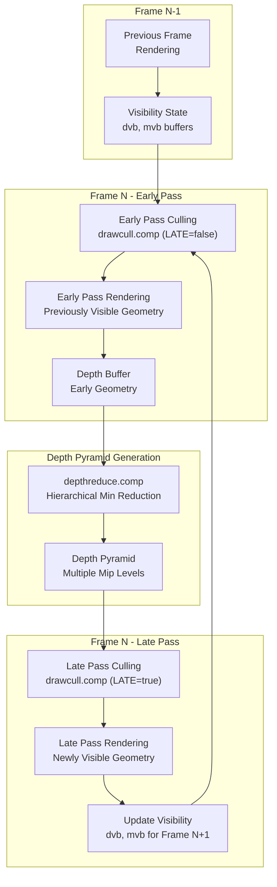
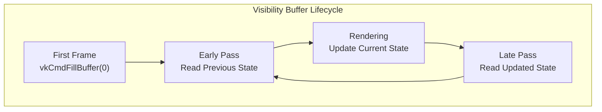
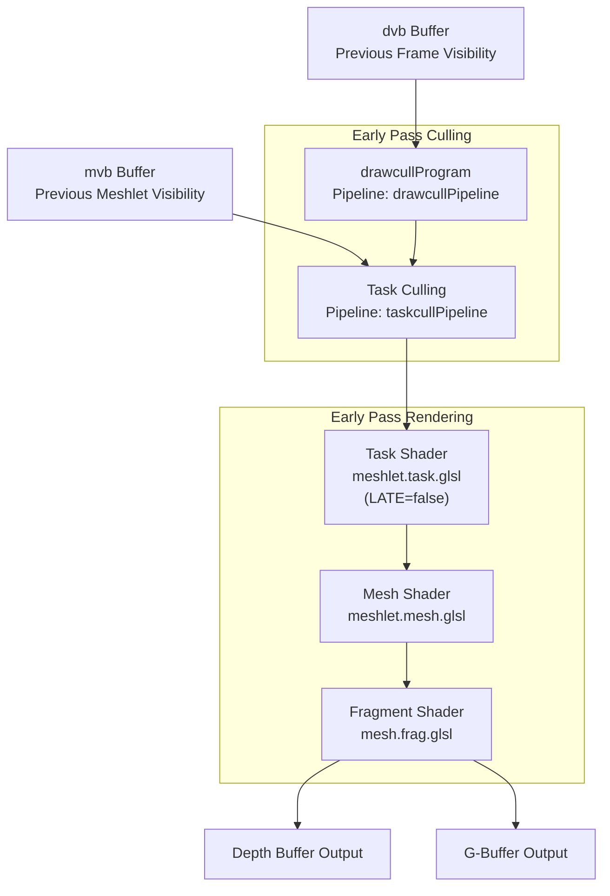
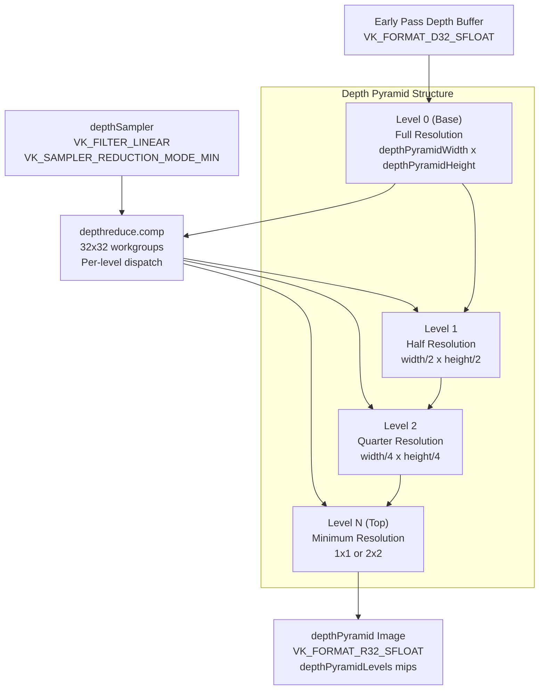
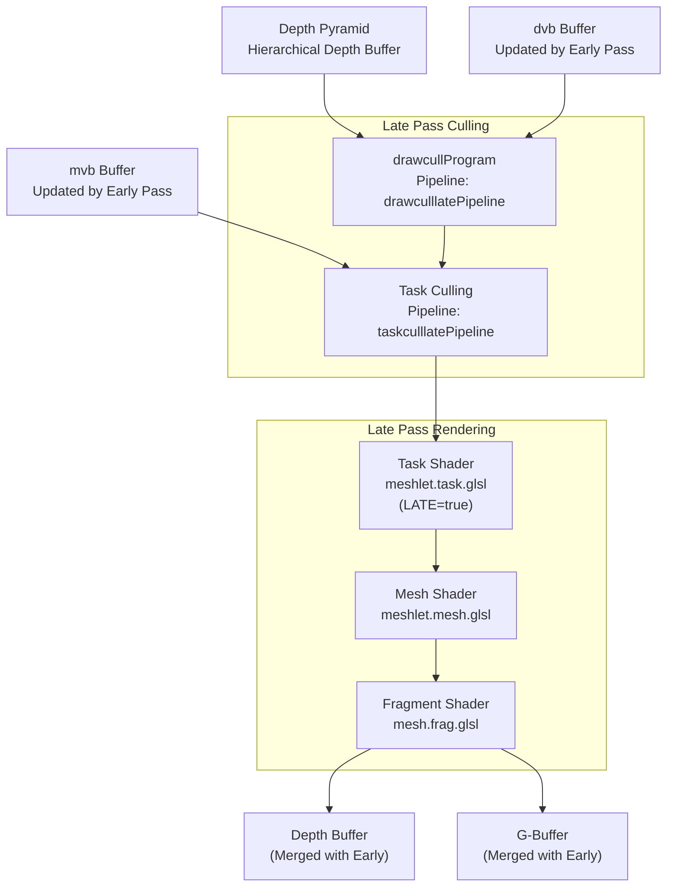
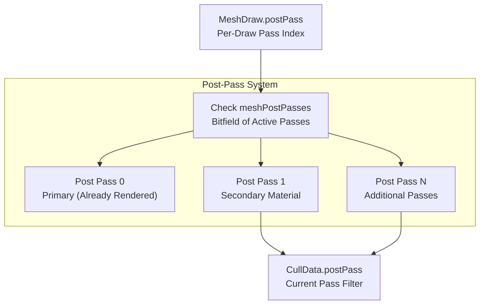
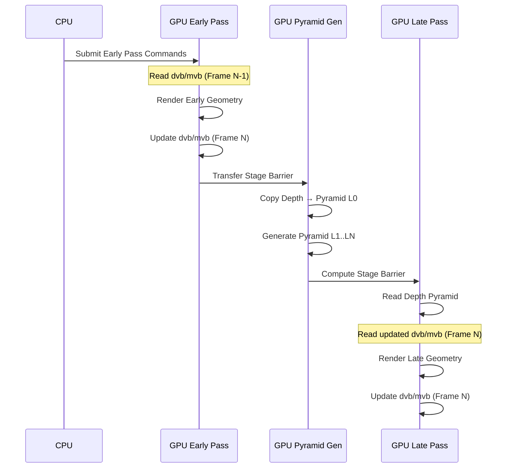

# Two-Phase Rendering Strategy

> **Relevant source files**
> * [src/niagara.cpp](https://github.com/zeux/niagara/blob/6f3fb529/src/niagara.cpp)
> * [src/resources.cpp](https://github.com/zeux/niagara/blob/6f3fb529/src/resources.cpp)
> * [src/resources.h](https://github.com/zeux/niagara/blob/6f3fb529/src/resources.h)
> * [src/shaders/depthreduce.comp.glsl](https://github.com/zeux/niagara/blob/6f3fb529/src/shaders/depthreduce.comp.glsl)

## Purpose and Scope

This document explains the two-phase rendering strategy employed by Niagara to maximize GPU efficiency through temporal coherency and hierarchical occlusion culling. The system splits geometry rendering into an **early pass** that renders previously-visible geometry and a **late pass** that discovers and renders newly-visible geometry using a depth pyramid built from the early pass results.

For information about the individual culling stages within each pass, see [Draw Culling Pipeline](/zeux/niagara/7.1-draw-culling-pipeline), [Task Shader Stage](/zeux/niagara/7.2-task-shader-stage), and [Mesh Shader Stage](/zeux/niagara/7.3-mesh-shader-stage). For details on the final composition of rendered geometry, see [Deferred Rendering](/zeux/niagara/8-deferred-rendering).

## Overview

The two-phase strategy addresses a fundamental challenge in GPU-driven rendering: efficiently culling occluded geometry without stalling the GPU pipeline. By splitting rendering into two phases separated by depth pyramid generation, the system achieves high culling efficiency while maintaining full GPU occupancy.



**Sources:** [src/niagara.cpp L1224-L1303](https://github.com/zeux/niagara/blob/6f3fb529/src/niagara.cpp#L1224-L1303)

 [src/niagara.cpp L1305-L1341](https://github.com/zeux/niagara/blob/6f3fb529/src/niagara.cpp#L1305-L1341)

## Visibility Buffer System

The renderer maintains persistent visibility state across frames using two buffer types that enable temporal coherency:

| Buffer | Type | Purpose | Granularity | Size Calculation |
| --- | --- | --- | --- | --- |
| `dvb` | Draw Visibility Buffer | Tracks which draw calls were visible last frame | Per-draw | `draws.size() * sizeof(uint32_t)` |
| `mvb` | Meshlet Visibility Buffer | Tracks which meshlets were visible last frame | Per-meshlet | `(meshletCount + 31) / 32 * sizeof(uint32_t)` (bitpacked) |

These buffers are initialized to zero on the first frame and subsequently updated by the rendering passes to reflect the current visibility state.



**Sources:** [src/niagara.cpp L822-L839](https://github.com/zeux/niagara/blob/6f3fb529/src/niagara.cpp#L822-L839)

 [src/niagara.cpp L1147-L1165](https://github.com/zeux/niagara/blob/6f3fb529/src/niagara.cpp#L1147-L1165)

### Draw Visibility Buffer (dvb)

The draw visibility buffer stores one 32-bit value per draw call, tracking whether the draw was visible in the previous frame. This enables the early pass to prioritize rendering of objects that were recently visible, which typically have high temporal coherency.

**Buffer Creation:**

```
Buffer dvb = {};
createBuffer(dvb, device, memoryProperties, draws.size() * sizeof(uint32_t), 
    VK_BUFFER_USAGE_STORAGE_BUFFER_BIT | VK_BUFFER_USAGE_TRANSFER_DST_BIT, 
    VK_MEMORY_PROPERTY_DEVICE_LOCAL_BIT);
```

**Initialization:**

```
if (!dvbCleared)
{
    vkCmdFillBuffer(commandBuffer, dvb.buffer, 0, sizeof(uint32_t) * draws.size(), 0);
    stageBarrier(commandBuffer, VK_PIPELINE_STAGE_TRANSFER_BIT, VK_PIPELINE_STAGE_COMPUTE_SHADER_BIT);
    dvbCleared = true;
}
```

**Sources:** [src/niagara.cpp L822-L824](https://github.com/zeux/niagara/blob/6f3fb529/src/niagara.cpp#L822-L824)

 [src/niagara.cpp L1147-L1155](https://github.com/zeux/niagara/blob/6f3fb529/src/niagara.cpp#L1147-L1155)

### Meshlet Visibility Buffer (mvb)

The meshlet visibility buffer stores bitpacked visibility state for individual meshlets. Each draw call has a range of meshlets, and the visibility buffer tracks which meshlets within that range were visible. This finer-grained tracking enables efficient culling at the task shader stage.

**Offset Calculation:**

```javascript
for (size_t i = 0; i < draws.size(); ++i)
{
    MeshDraw& draw = draws[i];
    const Mesh& mesh = geometry.meshes[draw.meshIndex];
    
    draw.meshletVisibilityOffset = meshletVisibilityCount;
    
    uint32_t meshletCount = 0;
    for (uint32_t i = 0; i < mesh.lodCount; ++i)
        meshletCount = std::max(meshletCount, mesh.lods[i].meshletCount);
    
    meshletVisibilityCount += meshletCount;
}

uint32_t meshletVisibilityBytes = (meshletVisibilityCount + 31) / 32 * sizeof(uint32_t);
```

**Sources:** [src/niagara.cpp L762-L780](https://github.com/zeux/niagara/blob/6f3fb529/src/niagara.cpp#L762-L780)

 [src/niagara.cpp L834-L839](https://github.com/zeux/niagara/blob/6f3fb529/src/niagara.cpp#L834-L839)

 [src/niagara.cpp L1157-L1165](https://github.com/zeux/niagara/blob/6f3fb529/src/niagara.cpp#L1157-L1165)

## Early Pass: Rendering Previously-Visible Geometry

The early pass renders geometry that was visible in the previous frame, using the visibility buffers to quickly identify and render these objects. This pass establishes a conservative depth buffer that serves as the foundation for occlusion culling in the late pass.



**Sources:** [src/niagara.cpp L1224-L1303](https://github.com/zeux/niagara/blob/6f3fb529/src/niagara.cpp#L1224-L1303)

 [src/niagara.cpp L1344-L1462](https://github.com/zeux/niagara/blob/6f3fb529/src/niagara.cpp#L1344-L1462)

### Early Pass Culling Configuration

The culling pipeline is configured to use the previous frame's visibility state without occlusion culling:

**CullData Configuration for Early Pass:**

```
CullData cullData = {};
cullData.view = view;
cullData.P00 = projection[0][0];
cullData.P11 = projection[1][1];
cullData.znear = camera.znear;
cullData.zfar = drawDistance;
cullData.frustum[0] = frustumX.x;
cullData.frustum[1] = frustumX.z;
cullData.frustum[2] = frustumY.y;
cullData.frustum[3] = frustumY.z;
cullData.drawCount = uint32_t(draws.size());
cullData.cullingEnabled = cullingEnabled;
cullData.lodEnabled = lodEnabled;
cullData.occlusionEnabled = occlusionEnabled;  // May be enabled or disabled
cullData.clusterOcclusionEnabled = false;      // Disabled for early pass
cullData.clusterBackfaceEnabled = true;        // Enabled for early pass
cullData.postPass = 0;                         // Primary geometry pass
```

**Pipeline Variants:**

* `drawcullPipeline`: Early pass draw culling (LATE=false, TASK=false)
* `taskcullPipeline`: Early pass task culling (LATE=false, TASK=true)

**Sources:** [src/niagara.cpp L1196-L1213](https://github.com/zeux/niagara/blob/6f3fb529/src/niagara.cpp#L1196-L1213)

 [src/niagara.cpp L1242-L1244](https://github.com/zeux/niagara/blob/6f3fb529/src/niagara.cpp#L1242-L1244)

 [src/niagara.cpp L533-L536](https://github.com/zeux/niagara/blob/6f3fb529/src/niagara.cpp#L533-L536)

### Early Pass Rendering Execution

The early pass rendering occurs with different pipeline configurations depending on whether mesh shading is enabled:

**Mesh Shading Path:**

```
cull(taskcullPipeline, 1, "early cull", /* late= */ false);
render(meshtaskPipeline, taskSubmit, /* late= */ false, /* postPass= */ 0);
```

**Traditional Path:**

```
cull(drawcullPipeline, 1, "early cull", /* late= */ false);
render(meshPipeline, taskSubmit, /* late= */ false, /* postPass= */ 0);
```

**Sources:** [src/niagara.cpp L1344-L1462](https://github.com/zeux/niagara/blob/6f3fb529/src/niagara.cpp#L1344-L1462)

## Depth Pyramid Generation

After the early pass completes, the renderer generates a hierarchical depth pyramid through iterative min-reduction. This pyramid enables efficient occlusion culling in the late pass by providing conservative depth bounds at multiple resolutions.



**Sources:** [src/niagara.cpp L1305-L1341](https://github.com/zeux/niagara/blob/6f3fb529/src/niagara.cpp#L1305-L1341)

 [src/shaders/depthreduce.comp.glsl L1-L22](https://github.com/zeux/niagara/blob/6f3fb529/src/shaders/depthreduce.comp.glsl#L1-L22)

### Pyramid Dimensions and Mip Levels

The depth pyramid dimensions are calculated to ensure all reductions are by exactly 2x2, which guarantees conservative depth values:

**Dimension Calculation:**

```
// previousPow2 ensures all reductions are at most by 2x2
depthPyramidWidth = previousPow2(swapchain.width);
depthPyramidHeight = previousPow2(swapchain.height);
depthPyramidLevels = getImageMipLevels(depthPyramidWidth, depthPyramidHeight);
```

**Image Creation:**

```
createImage(depthPyramid, device, memoryProperties, 
    depthPyramidWidth, depthPyramidHeight, depthPyramidLevels, 
    VK_FORMAT_R32_SFLOAT, 
    VK_IMAGE_USAGE_SAMPLED_BIT | VK_IMAGE_USAGE_STORAGE_BIT | VK_IMAGE_USAGE_TRANSFER_SRC_BIT);

for (uint32_t i = 0; i < depthPyramidLevels; ++i)
{
    depthPyramidMips[i] = createImageView(device, depthPyramid.image, VK_FORMAT_R32_SFLOAT, i, 1);
}
```

**Sources:** [src/niagara.cpp L1058-L1069](https://github.com/zeux/niagara/blob/6f3fb529/src/niagara.cpp#L1058-L1069)

 [src/niagara.cpp L292-L300](https://github.com/zeux/niagara/blob/6f3fb529/src/niagara.cpp#L292-L300)

### Depth Reduction Shader

The depth reduction is performed by a compute shader that samples the previous mip level using a min-reduction sampler:

**depthreduce.comp.glsl:**

```
layout(local_size_x = 32, local_size_y = 32, local_size_z = 1) in;

layout(binding = 0, r32f) uniform writeonly image2D outImage;
layout(binding = 1) uniform sampler2D inImage;

layout(push_constant) uniform block
{
    vec2 imageSize;
};

void main()
{
    uvec2 pos = gl_GlobalInvocationID.xy;
    
    // Sampler is set up to do min reduction, so this computes the minimum depth of a 2x2 texel quad
    float depth = texture(inImage, (vec2(pos) + vec2(0.5)) / imageSize).x;
    
    imageStore(outImage, ivec2(pos), vec4(depth));
}
```

**Sampler Configuration:**

```
VkSampler depthSampler = createSampler(device, 
    VK_FILTER_LINEAR, 
    VK_SAMPLER_MIPMAP_MODE_NEAREST, 
    VK_SAMPLER_ADDRESS_MODE_CLAMP_TO_EDGE, 
    VK_SAMPLER_REDUCTION_MODE_MIN);
```

**Sources:** [src/shaders/depthreduce.comp.glsl L1-L22](https://github.com/zeux/niagara/blob/6f3fb529/src/shaders/depthreduce.comp.glsl#L1-L22)

 [src/niagara.cpp L439-L440](https://github.com/zeux/niagara/blob/6f3fb529/src/niagara.cpp#L439-L440)

### Pyramid Generation Loop

The pyramid is built iteratively, generating each mip level from the previous one:

**Generation Code:**

```python
vkCmdWriteTimestamp(commandBuffer, VK_PIPELINE_STAGE_ALL_COMMANDS_BIT, queryPoolTimestamp, 6);

// Initial copy from depth buffer to pyramid level 0
{
    VkImageCopy region = {};
    region.srcSubresource.aspectMask = VK_IMAGE_ASPECT_DEPTH_BIT;
    region.srcSubresource.layerCount = 1;
    region.dstSubresource.aspectMask = VK_IMAGE_ASPECT_COLOR_BIT;
    region.dstSubresource.layerCount = 1;
    region.extent = { depthPyramidWidth, depthPyramidHeight, 1 };

    vkCmdCopyImage(commandBuffer, 
        depthTarget.image, VK_IMAGE_LAYOUT_GENERAL, 
        depthPyramid.image, VK_IMAGE_LAYOUT_GENERAL, 
        1, &region);
}

stageBarrier(commandBuffer, VK_PIPELINE_STAGE_TRANSFER_BIT, VK_PIPELINE_STAGE_COMPUTE_SHADER_BIT);

// Iteratively generate each mip level
uint32_t levelWidth = depthPyramidWidth;
uint32_t levelHeight = depthPyramidHeight;

for (uint32_t i = 1; i < depthPyramidLevels; ++i)
{
    levelWidth /= 2;
    levelHeight /= 2;

    vkCmdBindPipeline(commandBuffer, VK_PIPELINE_BIND_POINT_COMPUTE, depthreducePipeline);

    DescriptorInfo pyramidDesc(depthSampler, depthPyramidMips[i - 1]);
    DescriptorInfo descriptors[] = { depthPyramidMips[i], pyramidDesc };

    vec4 pushConstants(levelWidth, levelHeight, 0, 0);
    dispatch(commandBuffer, depthreduceProgram, levelWidth, levelHeight, pushConstants, descriptors);

    stageBarrier(commandBuffer, VK_PIPELINE_STAGE_COMPUTE_SHADER_BIT);
}

vkCmdWriteTimestamp(commandBuffer, VK_PIPELINE_STAGE_ALL_COMMANDS_BIT, queryPoolTimestamp, 7);
```

**Sources:** [src/niagara.cpp L1305-L1341](https://github.com/zeux/niagara/blob/6f3fb529/src/niagara.cpp#L1305-L1341)

## Late Pass: Discovering Newly-Visible Geometry

The late pass performs occlusion culling against the depth pyramid to discover and render geometry that was not visible in the early pass. This includes objects that were occluded in the previous frame but are now visible due to camera movement.



**Sources:** [src/niagara.cpp L1464-L1585](https://github.com/zeux/niagara/blob/6f3fb529/src/niagara.cpp#L1464-L1585)

### Late Pass Culling Configuration

The late pass culling differs from the early pass by enabling occlusion culling with the depth pyramid:

**CullData Configuration for Late Pass:**

```
CullData passData = cullData;
passData.clusterBackfaceEnabled = false;       // Disabled for late pass
passData.occlusionEnabled = true;              // Always enabled
passData.clusterOcclusionEnabled = true;       // Enabled if supported
passData.postPass = postPass;                  // Current post pass index
```

**Pipeline Variants:**

* `drawculllatePipeline`: Late pass draw culling (LATE=true, TASK=false)
* `taskculllatePipeline`: Late pass task culling (LATE=true, TASK=true)

**Depth Pyramid Binding:**

```
DescriptorInfo pyramidDesc(depthSampler, depthPyramid.imageView);
DescriptorInfo descriptors[] = { db.buffer, mb.buffer, dcb.buffer, dccb.buffer, dvb.buffer, pyramidDesc };

dispatch(commandBuffer, drawcullProgram, uint32_t(draws.size()), 1, passData, descriptors);
```

**Sources:** [src/niagara.cpp L1241-L1252](https://github.com/zeux/niagara/blob/6f3fb529/src/niagara.cpp#L1241-L1252)

 [src/niagara.cpp L534-L536](https://github.com/zeux/niagara/blob/6f3fb529/src/niagara.cpp#L534-L536)

### Late Pass Execution

The late pass is executed similarly to the early pass but with late-pass-specific pipelines:

**Mesh Shading Path:**

```
cull(taskculllatePipeline, 9, "late cull", /* late= */ true);
render(meshtasklatePipeline, taskSubmit, /* late= */ true, /* postPass= */ 0);
```

**Traditional Path:**

```
cull(drawculllatePipeline, 9, "late cull", /* late= */ true);
render(meshPipeline, taskSubmit, /* late= */ true, /* postPass= */ 0);
```

**Sources:** [src/niagara.cpp L1464-L1585](https://github.com/zeux/niagara/blob/6f3fb529/src/niagara.cpp#L1464-L1585)

## Post-Pass Rendering

After the primary early and late passes complete, the renderer may execute additional post-passes for geometry requiring special handling (e.g., different material passes, transparency). These post-passes reuse the depth pyramid for occlusion culling but render only draws marked with specific post-pass indices.



**Post-Pass Bitfield:**

```
uint32_t meshPostPasses = 0;

for (size_t i = 0; i < draws.size(); ++i)
{
    MeshDraw& draw = draws[i];
    meshPostPasses |= 1 << draw.postPass;
}
```

**Post-Pass Loop:**

```
for (unsigned int postPass = 1; postPass < 32; ++postPass)
{
    if ((meshPostPasses & (1 << postPass)) == 0)
        continue;

    cull(taskculllatePipeline, 12, "post cull", /* late= */ true, postPass);
    render(meshtaskpostPipeline, taskSubmit, /* late= */ true, postPass);
}
```

**Sources:** [src/niagara.cpp L762-L778](https://github.com/zeux/niagara/blob/6f3fb529/src/niagara.cpp#L762-L778)

 [src/niagara.cpp L1587-L1599](https://github.com/zeux/niagara/blob/6f3fb529/src/niagara.cpp#L1587-L1599)

 [src/niagara.cpp L1242-L1244](https://github.com/zeux/niagara/blob/6f3fb529/src/niagara.cpp#L1242-L1244)

## Performance Characteristics

The two-phase rendering strategy provides several performance benefits:

### Temporal Coherency Benefits

| Aspect | Early Pass | Late Pass | Benefit |
| --- | --- | --- | --- |
| **Culling Efficiency** | High (uses cached visibility) | Medium (occlusion queries) | Minimizes redundant culling work |
| **Depth Establishment** | Fast (renders known-visible) | Conservative (behind early depth) | Early-Z rejection in late pass |
| **GPU Occupancy** | Full (no occlusion queries) | High (coarse hierarchy) | Maintains parallel execution |
| **Memory Traffic** | Low (compact visibility state) | Medium (pyramid lookups) | Reduces bandwidth pressure |

### Occlusion Culling Effectiveness

The hierarchical depth pyramid enables efficient occlusion testing at multiple granularities:

1. **Draw-level culling**: Tests bounding spheres against pyramid levels matching the sphere's screen-space size
2. **Meshlet-level culling**: Tests individual meshlet bounds in the task shader stage
3. **Triangle-level culling**: Performs final per-triangle tests in the mesh shader stage

**Conservative Depth Guarantee:**

The min-reduction sampler ensures the pyramid contains conservative (farthest) depth values. An object is culled only if its nearest point is behind the pyramid depth at all covering texels, guaranteeing no false-positive culling.

**Sources:** [src/niagara.cpp L1224-L1303](https://github.com/zeux/niagara/blob/6f3fb529/src/niagara.cpp#L1224-L1303)

 [src/niagara.cpp L439-L440](https://github.com/zeux/niagara/blob/6f3fb529/src/niagara.cpp#L439-L440)

## Frame Synchronization and Buffer Updates

The visibility buffers are updated continuously during rendering, creating dependencies that must be carefully managed:



**Barrier Management:**

Key synchronization points ensure correct buffer access ordering:

1. **Transfer → Compute**: After visibility buffer initialization
2. **Rasterization → Transfer**: Before depth pyramid copy
3. **Transfer → Compute**: After pyramid level 0 copy
4. **Compute → Compute**: Between pyramid mip levels
5. **Compute → Rasterization**: Before late pass rendering

**Sources:** [src/niagara.cpp L1147-L1165](https://github.com/zeux/niagara/blob/6f3fb529/src/niagara.cpp#L1147-L1165)

 [src/niagara.cpp L1305-L1341](https://github.com/zeux/niagara/blob/6f3fb529/src/niagara.cpp#L1305-L1341)

 [src/resources.cpp L91-L100](https://github.com/zeux/niagara/blob/6f3fb529/src/resources.cpp#L91-L100)

## Configuration and Toggles

The two-phase rendering strategy can be dynamically configured through runtime flags:

| Flag | Type | Effect | Default |
| --- | --- | --- | --- |
| `occlusionEnabled` | `bool` | Enable/disable occlusion culling | `true` |
| `clusterOcclusionEnabled` | `bool` | Enable/disable meshlet-level occlusion | `true` |
| `cullingEnabled` | `bool` | Enable/disable all culling | `true` |
| `lodEnabled` | `bool` | Enable/disable LOD selection | `true` |

**Runtime Control:**

These flags can be toggled via keyboard input during execution:

* `O` key: Toggle `occlusionEnabled`
* `K` key: Toggle `clusterOcclusionEnabled`
* `C` key: Toggle `cullingEnabled`
* `L` key: Toggle `lodEnabled`

**CullData Configuration:**

```
cullData.cullingEnabled = cullingEnabled;
cullData.lodEnabled = lodEnabled;
cullData.occlusionEnabled = occlusionEnabled;
cullData.clusterOcclusionEnabled = occlusionEnabled && clusterOcclusionEnabled && meshShadingSupported && meshShadingEnabled;
```

**Sources:** [src/niagara.cpp L32-L34](https://github.com/zeux/niagara/blob/6f3fb529/src/niagara.cpp#L32-L34)

 [src/niagara.cpp L192-L215](https://github.com/zeux/niagara/blob/6f3fb529/src/niagara.cpp#L192-L215)

 [src/niagara.cpp L1207-L1213](https://github.com/zeux/niagara/blob/6f3fb529/src/niagara.cpp#L1207-L1213)