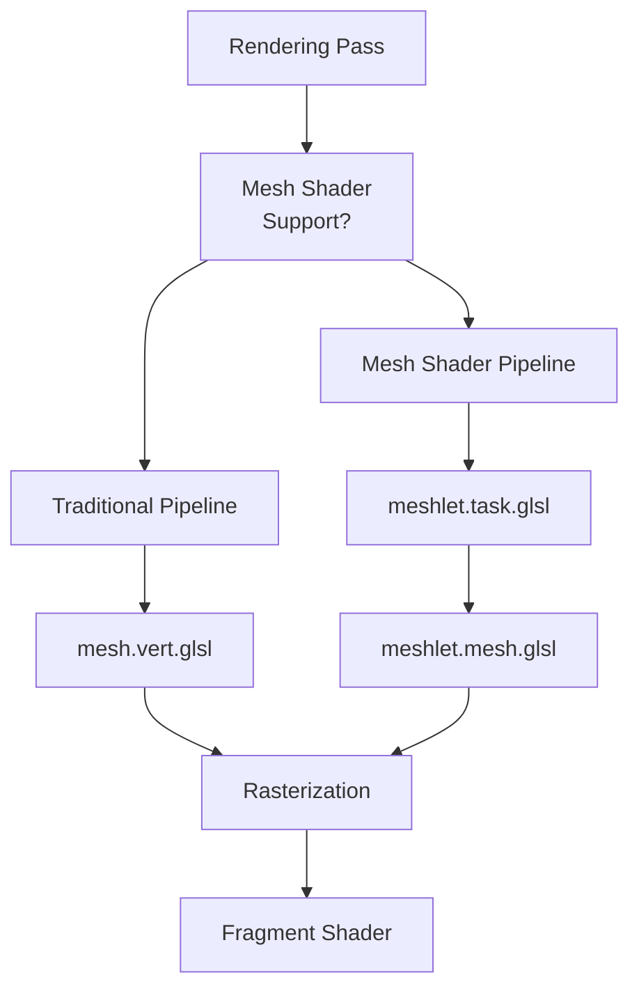
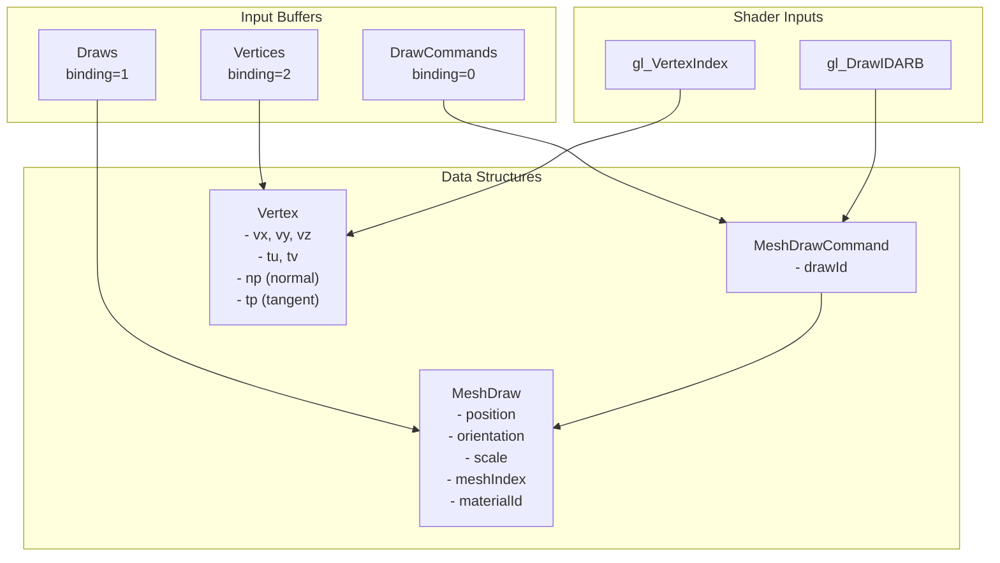
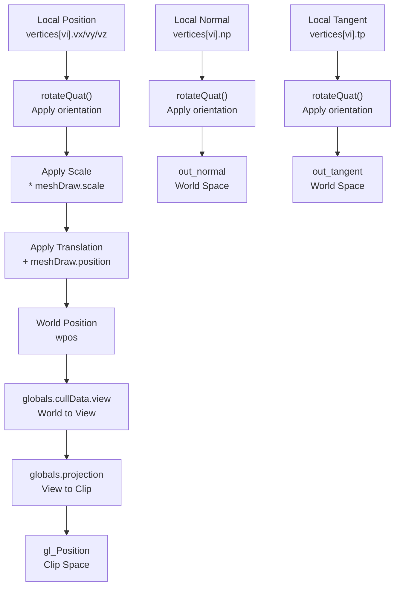
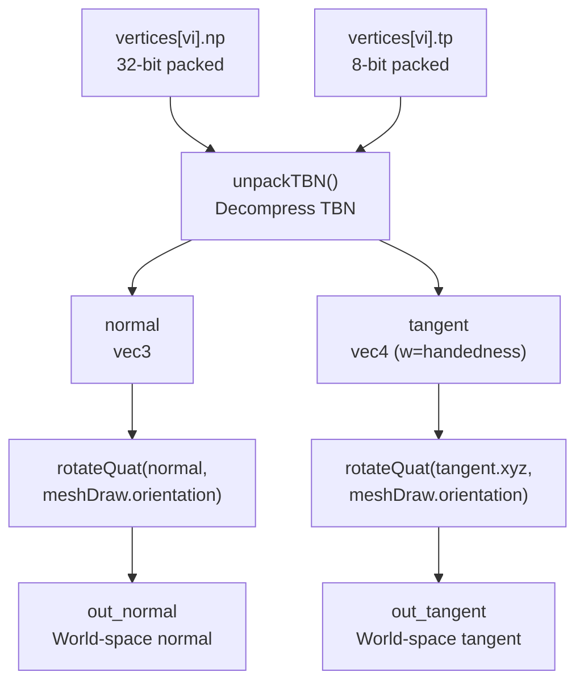
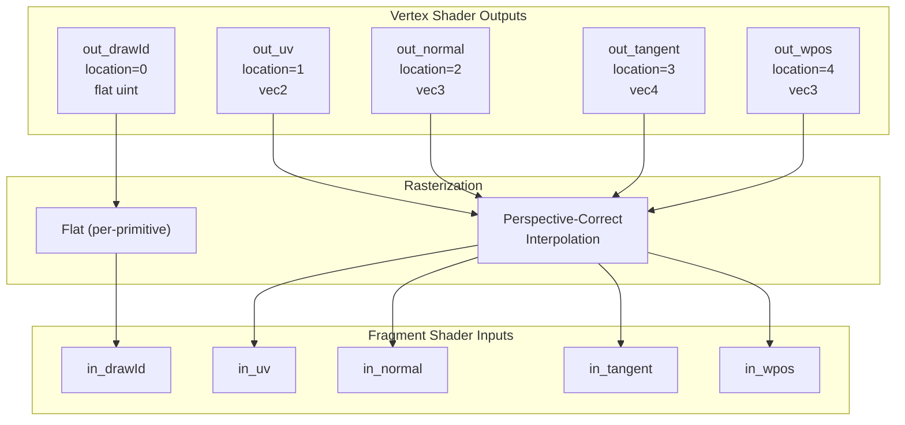
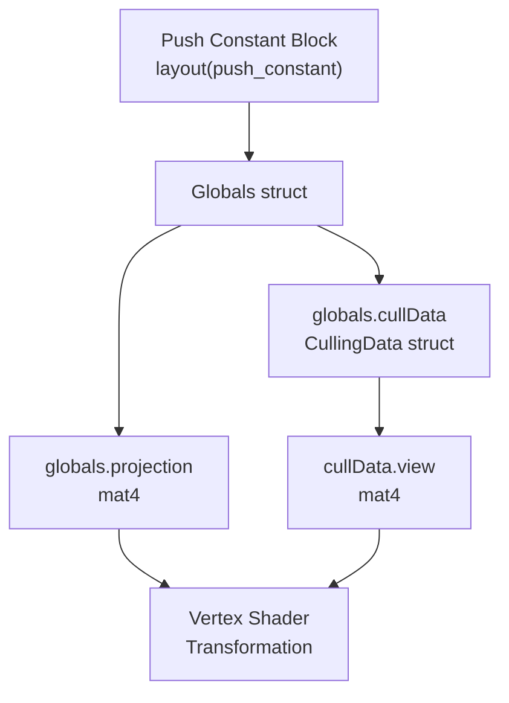

# Vertex Processing

> **Relevant source files**
> * [src/shaders/mesh.vert.glsl](https://github.com/zeux/niagara/blob/6f3fb529/src/shaders/mesh.vert.glsl)

## Purpose and Scope

This document explains how vertex data is transformed and processed in the Niagara renderer to produce per-vertex attributes for rasterization. Vertex processing occurs in two possible execution paths: the traditional vertex shader (`mesh.vert.glsl`) and the mesh shader stage (`meshlet.mesh.glsl`). This page focuses on the vertex transformation pipeline, including position transformation, normal/tangent unpacking, and attribute generation.

For information about the mesh shader pipeline that performs vertex processing alongside meshlet culling, see [Mesh Shader Stage](/zeux/niagara/7.3-mesh-shader-stage). For details about how the resulting vertex attributes are consumed to generate G-buffer data, see [G-Buffer Generation](/zeux/niagara/8.2-g-buffer-generation).

## Vertex Processing Paths

The Niagara renderer supports two paths for vertex processing, providing compatibility across different hardware capabilities:

| Path | Shader Stage | Primary Use Case | Feature Level |
| --- | --- | --- | --- |
| Traditional | `mesh.vert.glsl` | Fallback for hardware without mesh shader support | Vulkan 1.0+ |
| Mesh Shader | `meshlet.mesh.glsl` | GPU-driven rendering with fine-grained culling | Vulkan 1.3+ with mesh shaders |

Both paths perform equivalent vertex transformations and produce identical output attributes, ensuring visual consistency regardless of the execution path.

**Execution Path Selection Diagram**



Sources: [src/shaders/mesh.vert.glsl L1-L64](https://github.com/zeux/niagara/blob/6f3fb529/src/shaders/mesh.vert.glsl#L1-L64)

## Input Data Structures

Vertex processing consumes three primary buffer types to access geometry and instance data:

**Buffer Binding Diagram**



Sources: [src/shaders/mesh.vert.glsl L18-L31](https://github.com/zeux/niagara/blob/6f3fb529/src/shaders/mesh.vert.glsl#L18-L31)

### DrawCommands Buffer

The `DrawCommands` buffer contains `MeshDrawCommand` structures that map indirect draw calls to logical draw IDs. Each command specifies which `MeshDraw` instance should be used for the draw call.

Access pattern: [src/shaders/mesh.vert.glsl L41](https://github.com/zeux/niagara/blob/6f3fb529/src/shaders/mesh.vert.glsl#L41-L41)

```
uint drawId = drawCommands[gl_DrawIDARB].drawId;
```

### Draws Buffer

The `Draws` buffer contains `MeshDraw` structures that define per-instance transformation and material data. Each entry includes:

* **position**: World-space translation vector
* **orientation**: Rotation quaternion
* **scale**: Uniform scale factor
* **meshIndex**: Reference to mesh geometry
* **materialId**: Reference to material properties

Access pattern: [src/shaders/mesh.vert.glsl L42](https://github.com/zeux/niagara/blob/6f3fb529/src/shaders/mesh.vert.glsl#L42-L42)

```
MeshDraw meshDraw = draws[drawId];
```

### Vertices Buffer

The `Vertices` buffer contains compressed `Vertex` structures with:

* **vx, vy, vz**: Position coordinates (16-bit integers)
* **tu, tv**: Texture coordinates (16-bit floats)
* **np**: Packed normal vector (32-bit)
* **tp**: Packed tangent vector with handedness (8-bit)

The vertex data uses compressed formats to reduce memory bandwidth and storage requirements. Position and normal/tangent data must be unpacked before use.

Access pattern: [src/shaders/mesh.vert.glsl L44-L50](https://github.com/zeux/niagara/blob/6f3fb529/src/shaders/mesh.vert.glsl#L44-L50)

Sources: [src/shaders/mesh.vert.glsl L18-L31](https://github.com/zeux/niagara/blob/6f3fb529/src/shaders/mesh.vert.glsl#L18-L31)

## Vertex Transformation Pipeline

The vertex transformation pipeline converts vertex data from local object space to clip space through multiple coordinate system transformations.

**Transformation Flow Diagram**



Sources: [src/shaders/mesh.vert.glsl L45-L62](https://github.com/zeux/niagara/blob/6f3fb529/src/shaders/mesh.vert.glsl#L45-L62)

### Position Transformation

Position transformation occurs in three stages:

1. **Unpack Position**: Extract 16-bit integer coordinates and convert to floating point [src/shaders/mesh.vert.glsl L45](https://github.com/zeux/niagara/blob/6f3fb529/src/shaders/mesh.vert.glsl#L45-L45) ``` vec3 position = vec3(vertices[vi].vx, vertices[vi].vy, vertices[vi].vz); ```
2. **Transform to World Space**: Apply instance transformation [src/shaders/mesh.vert.glsl L55](https://github.com/zeux/niagara/blob/6f3fb529/src/shaders/mesh.vert.glsl#L55-L55) ``` vec3 wpos = rotateQuat(position, meshDraw.orientation) * meshDraw.scale + meshDraw.position; ``` This applies rotation (via quaternion), uniform scale, and translation in sequence.
3. **Transform to Clip Space**: Apply view and projection matrices [src/shaders/mesh.vert.glsl L57](https://github.com/zeux/niagara/blob/6f3fb529/src/shaders/mesh.vert.glsl#L57-L57) ``` gl_Position = globals.projection * (globals.cullData.view * vec4(wpos, 1)); ```

The world position is also output as `out_wpos` for use in lighting calculations in the fragment shader.

Sources: [src/shaders/mesh.vert.glsl L45-L57](https://github.com/zeux/niagara/blob/6f3fb529/src/shaders/mesh.vert.glsl#L45-L57)

### Quaternion-Based Rotation

The renderer uses quaternion-based rotations via the `rotateQuat()` function from `math.h`. Quaternions provide several advantages over matrix rotations:

* More compact storage (4 floats vs 9 for a 3x3 matrix)
* No gimbal lock
* Efficient GPU interpolation

The quaternion is applied to both positions and direction vectors (normals, tangents) to maintain correct orientation in world space.

Sources: [src/shaders/mesh.vert.glsl L52-L55](https://github.com/zeux/niagara/blob/6f3fb529/src/shaders/mesh.vert.glsl#L52-L55)

## Normal and Tangent Processing

Normals and tangents are stored in compressed formats and must be unpacked before transformation. The renderer uses octahedral encoding for normals and a compact representation for tangents.

**Normal/Tangent Processing Pipeline**



Sources: [src/shaders/mesh.vert.glsl L48-L61](https://github.com/zeux/niagara/blob/6f3fb529/src/shaders/mesh.vert.glsl#L48-L61)

### TBN Unpacking

The `unpackTBN()` function decompresses the tangent-binormal-normal basis:

[src/shaders/mesh.vert.glsl L50](https://github.com/zeux/niagara/blob/6f3fb529/src/shaders/mesh.vert.glsl#L50-L50)

```
unpackTBN(vertices[vi].np, uint(vertices[vi].tp), normal, tangent);
```

The function decodes:

* **Normal**: Reconstructed from octahedral encoding in the `np` field
* **Tangent**: Reconstructed as a 3D vector with handedness stored in the `w` component
* **Binormal**: Can be computed in the fragment shader as `cross(normal, tangent.xyz) * tangent.w`

### World-Space Transformation

After unpacking, normals and tangents are transformed to world space by applying the instance orientation quaternion:

[src/shaders/mesh.vert.glsl L52-L53](https://github.com/zeux/niagara/blob/6f3fb529/src/shaders/mesh.vert.glsl#L52-L53)

```
normal = rotateQuat(normal, meshDraw.orientation);
tangent.xyz = rotateQuat(tangent.xyz, meshDraw.orientation);
```

Notably, the scale factor is **not** applied to normals and tangents, as they are direction vectors that should remain unit length after normalization in the fragment shader. The tangent's `w` component (handedness) is preserved unchanged.

Sources: [src/shaders/mesh.vert.glsl L48-L61](https://github.com/zeux/niagara/blob/6f3fb529/src/shaders/mesh.vert.glsl#L48-L61)

## Output Attributes

The vertex shader produces six output attributes that are interpolated across triangle faces and consumed by the fragment shader:

| Location | Attribute | Type | Description | Interpolation |
| --- | --- | --- | --- | --- |
| 0 | `out_drawId` | `flat uint` | Draw instance identifier | Flat (no interpolation) |
| 1 | `out_uv` | `vec2` | Texture coordinates | Perspective-correct |
| 2 | `out_normal` | `vec3` | World-space normal | Perspective-correct |
| 3 | `out_tangent` | `vec4` | World-space tangent + handedness | Perspective-correct |
| 4 | `out_wpos` | `vec3` | World-space position | Perspective-correct |

**Attribute Output Flow**



Sources: [src/shaders/mesh.vert.glsl L33-L62](https://github.com/zeux/niagara/blob/6f3fb529/src/shaders/mesh.vert.glsl#L33-L62)

### Draw ID (flat)

The draw ID is output with the `flat` qualifier, indicating no interpolation. All fragments generated from a triangle receive the same draw ID value, which is used to index into material and mesh metadata in the fragment shader.

[src/shaders/mesh.vert.glsl L33-L58](https://github.com/zeux/niagara/blob/6f3fb529/src/shaders/mesh.vert.glsl#L33-L58)

### Texture Coordinates

Texture coordinates are unpacked from 16-bit half-precision floats and output directly without transformation:

[src/shaders/mesh.vert.glsl L46-L59](https://github.com/zeux/niagara/blob/6f3fb529/src/shaders/mesh.vert.glsl#L46-L59)

```
vec2 texcoord = vec2(vertices[vi].tu, vertices[vi].tv);
out_uv = texcoord;
```

### Normals and Tangents

World-space normals and tangents are output after decompression and transformation. These vectors are used in the fragment shader to:

* Compute lighting (normal)
* Sample normal maps (tangent space basis)
* Perform geometric calculations

The tangent's `w` component preserves the handedness needed to compute the correct binormal direction.

[src/shaders/mesh.vert.glsl L60-L61](https://github.com/zeux/niagara/blob/6f3fb529/src/shaders/mesh.vert.glsl#L60-L61)

### World Position

The world-space position is output to enable:

* View-direction calculations for specular lighting
* Distance-based effects
* Screen-space derivatives for filtering

[src/shaders/mesh.vert.glsl L62](https://github.com/zeux/niagara/blob/6f3fb529/src/shaders/mesh.vert.glsl#L62-L62)

Sources: [src/shaders/mesh.vert.glsl L33-L62](https://github.com/zeux/niagara/blob/6f3fb529/src/shaders/mesh.vert.glsl#L33-L62)

## Shader Inputs and Constants

The vertex shader receives global rendering parameters through push constants:

**Push Constants Structure**



Sources: [src/shaders/mesh.vert.glsl L13-L16](https://github.com/zeux/niagara/blob/6f3fb529/src/shaders/mesh.vert.glsl#L13-L16)

The `Globals` structure provides:

* **projection**: Projection matrix for clip-space transformation
* **cullData.view**: View matrix for world-to-view transformation

These matrices are updated per-frame based on camera parameters and are shared across all rendering passes.

Sources: [src/shaders/mesh.vert.glsl L13-L57](https://github.com/zeux/niagara/blob/6f3fb529/src/shaders/mesh.vert.glsl#L13-L57)

## Mesh Shader Equivalence

The mesh shader path performs equivalent vertex processing within the mesh shader stage. The key differences are:

1. **Execution Model**: Mesh shaders process meshlets (groups of vertices) rather than individual vertices
2. **Culling Integration**: Mesh shaders perform triangle culling after vertex transformation
3. **Output Method**: Mesh shaders explicitly set vertex attributes via `gl_MeshVerticesEXT` array writes

Despite these differences, the actual transformation code (position calculation, normal rotation, etc.) is identical between the vertex shader and mesh shader implementations to ensure visual parity.

For detailed information about the mesh shader implementation, see [Mesh Shader Stage](/zeux/niagara/7.3-mesh-shader-stage).

Sources: [src/shaders/mesh.vert.glsl L1-L64](https://github.com/zeux/niagara/blob/6f3fb529/src/shaders/mesh.vert.glsl#L1-L64)